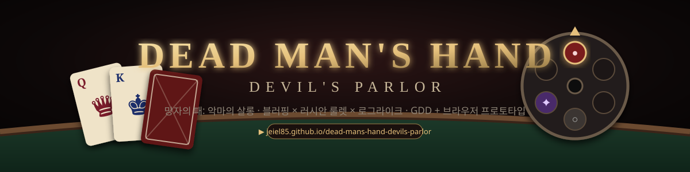

<div align="center">



# Dead Man's Hand: Devil's Parlor
### 망자의 패: 악마의 살롱

**블러핑 카드 게임 × 러시안 룰렛 × 로그라이크** — 인디게임 설계서(GDD)와, 그 설계를 그대로 플레이할 수 있는 브라우저 프로토타입

[](https://jeiel85.github.io/dead-mans-hand-devils-parlor/)
[](docs/GDD.md)
[](https://github.com/jeiel85/dead-mans-hand-devils-parlor/actions/workflows/ci.yml)
[](LICENSE)

**▶ 지금 플레이: <https://jeiel85.github.io/dead-mans-hand-devils-parlor/>** · 설치 없음 · 데스크톱/모바일 · 한국어/English

</div>

---

## 이 저장소는 무엇인가

《Liar's Bar》와 《Buckshot Roulette》가 바이럴된 이유와 한계를 분석하고, 그 위에 **네 가지 +α**를 얹은 인디게임 기획·설계 프로젝트입니다.

| +α | 한 줄 |
| :-- | :-- |
| **싱글 로그라이크 층계 돌파** | 빈민가 골목(B1)부터 악마의 VIP룸(B7)까지, 기믹이 다른 딜러 보스 7명 |
| **전술적 사기 도구 & 적발 리스크** | 밑장빼기·납 탄환 바꿔치기·탁자 밑 거울·악마의 계약서. 딜러의 집중도에 따라 들키면 즉시 격발 |
| **비동기 고스트 대전** | 실제 유저의 결정 로그로 조정된 상대. 매치메이킹 대기·탈주 없음 *(설계 확정, 미구현)* |
| **스트리밍 시청자 개입** | `!진실`/`!구라` 투표, 최다 후원자 대리 격발 연출 *(설계 확정, 미구현)* |

문서만 있는 설계서가 아니라, **설계서의 룰·수치가 그대로 돌아가는 프로토타입**이 함께 있습니다. 설계서의 모든 수치(`docs/GDD.md` §6, §8)는 코드(`src/data.js`)와 같은 값이며, 밸런스 표는 시뮬레이터(`tools/simulate.js`)로 재현할 수 있습니다.

## 30초 룰

1. 20장 덱(킹 6 · 퀸 6 · 에이스 6 · 조커 2). 매 라운드 5장씩 받고 **테이블 랭크**가 정해진다.
2. 카드 1~3장을 뒤집어 내려놓으며 "전부 테이블 랭크"라고 주장한다. 조커는 무엇이든 된다.
3. 상대는 **의심(Call)** 하거나 **믿는다(Pass)**. 믿으면 상대 차례. 패가 없으면 의심할 수밖에 없다.
4. 의심하면 공개. **거짓이면 낸 사람이, 진실이면 의심한 사람이** 리볼버 방아쇠를 자기 머리에 당긴다.
5. 6연발 실린더의 탄 구성(실탄/공포탄/저주탄)은 공개, 순서는 비공개. 매 라운드 정확히 한 발.
6. 자기 차례에 사기 도구를 한 번 쓸 수 있다. 들키면 즉시 격발. 딜러 체력을 0으로 만들면 다음 층으로.

**조작**: 카드 클릭/Enter로 선택, `C` 의심, `P` 믿기. 상단에서 언어·소리·15초 타이머를 끌 수 있습니다.

## 프로토타입 범위

| 구현됨 (플레이 가능) | 설계만 확정 (본 개발 대상) |
| :-- | :-- |
| 코어 루프(선언 → 의심/믿기 → 공개 → 격발), 강제 콜, 실린더 재장전 | Godot 4 / Unity 2.5D 본 개발 |
| 7층 · 딜러 7명(각각 다른 페르소나 파라미터와 기믹) | 비동기 고스트 대전(기록 포맷·재생·프라이버시 스펙) |
| 사기 도구 4종 + 적발 판정, 유물 8종, 층 보상 | Twitch EventSub 시청자 투표·대리 격발 |
| 딜러 AI(거짓 추정, 콜 점수, 블러핑 습관 학습) | 다인 테이블(3~4인) |
| 시드 재현, KR/EN, 타이머·소리 옵션, 모션 축소, 색약 이중 표기, 모바일 반응형 | 런 이어하기, 런 간 메타 프로그레션 |
| Web Audio 절차 사운드(외부 에셋 0), 테스트 21건, 밸런스 시뮬레이터, CI | 아트·실녹음 사운드 |

## 밸런스 (시뮬레이션 3,000런)

| | 초심자 봇 | 숙련 봇 |
| :-- | --: | --: |
| B1 통과율 | 85.8% | 95.8% |
| 풀 런(7층) 승률 | 3.1% | 50.7% |
| 평균 라운드 | 26.1 | 39.9 |

재현: `node tools/simulate.js 3000 both`. 층별 표와 튜닝 기록은 [GDD §8](docs/GDD.md#8-밸런스--시뮬레이션-).

## 문서

| 문서 | 내용 |
| :-- | :-- |
| [`docs/GDD.md`](docs/GDD.md) | **설계서 v1.1.0** — 벤치마킹, +α, 코어 룰·엣지케이스, 사기 시스템, 7층·딜러·유물, AI, 밸런스, FSM, 고스트·스트리밍 스펙, UX·접근성, 아키텍처, 로드맵, KPI, 리스크 |
| [`docs/CHANGELOG.md`](docs/CHANGELOG.md) | v1.0.0 → v1.1.0에서 **무엇을 정정·보강했는지** (원본 코드의 실린더 순환 버그, 저주탄 미정의 등) |
| [`docs/DECISIONS.md`](docs/DECISIONS.md) | 되돌리기 어려운 결정 7건과 근거 |
| [`docs/BACKLOG.md`](docs/BACKLOG.md) | 미뤄둔 개선점 |
| [`docs/archive/`](docs/archive/) | 2026-09-09 원본 설계서·패키지 README (내용 무수정 보관) |

## 로컬 실행 · 테스트

빌드 도구와 의존성이 없습니다. 정적 서버만 있으면 됩니다.

```bash
git clone https://github.com/jeiel85/dead-mans-hand-devils-parlor.git
cd dead-mans-hand-devils-parlor
python -m http.server 8080        # 또는 npx serve .
# → http://localhost:8080
```

```bash
npm test                          # 엔진·AI 단위 테스트 + 300런 퍼즈 (Node 20+)
node tools/simulate.js 3000 both  # 밸런스 시뮬레이션 (naive / sharp 봇)
```

## 저장소 구조

```
index.html, styles.css   프로토타입 UI (GitHub Pages 루트)
src/data.js              층·딜러·도구·유물 수치 — 단일 진실 원천
src/rules.js             순수 게임 엔진 (상태·액션·이벤트, DOM 없음)
src/ai.js                딜러 AI
src/render.js, main.js   렌더링 · 컨트롤러 · 연출 · 타이머
src/audio.js, i18n.js    절차 사운드 · 한국어/영어 문자열
tests/                   node:test
tools/simulate.js        밸런스 시뮬레이터
docs/                    설계서와 부속 문서
```

## 로드맵

- **P0 (완료)**: 웹 프로토타입으로 룰·밸런스 검증, 라이브 데모 공개
- **P1**: 외부 10명 무언 플레이테스트 → 메타 프로그레션 방식 결정
- **P2**: Godot/Unity 코어 포팅(같은 시드로 교차 검증), 로컬 고스트, B1~B3 아트
- **P3**: Twitch 연동, 스팀 데모 빌드

자세한 게이트 기준은 [GDD §14~15](docs/GDD.md#14-개발-로드맵).

## 고지

《Liar's Bar》, 《Buckshot Roulette》, 《Inscryption》, 《Balatro》는 각 권리자의 작품이며 이 프로젝트는 이들과 무관한 독립 기획입니다. 카드 룰의 골격은 퍼블릭 도메인 계열(Liar's Dice / Cheat)에 속하고, 명칭·아트·연출·시스템은 독자적으로 설계했습니다. 이 게임은 러시안 룰렛(자해) 연출을 포함합니다.

라이선스: [MIT](LICENSE)

---

<details>
<summary><strong>English</strong></summary>

### Dead Man's Hand: Devil's Parlor

A **bluffing card game × russian roulette × roguelike** — a game design document (GDD) plus a browser-playable prototype that runs the exact rules and numbers in the document.

**▶ Play now: <https://jeiel85.github.io/dead-mans-hand-devils-parlor/>** (no install, desktop & mobile, KR/EN)

**Pitch.** *Liar's Bar* and *Buckshot Roulette* went viral on 15-second micro-climaxes and three-second rules, then burned out in 5–10 hours. This project keeps the loop and adds four things: a **single-player roguelike descent** through seven dealer bosses with distinct gimmicks; **tactical cheat items** (bottom deal, lead weight, under-table mirror, pact of greed) whose detection risk scales with each dealer's focus; **asynchronous ghost matches** built from real players' decision logs (designed, not yet implemented); and **stream integration** with `!truth`/`!lie` votes and proxy trigger pulls (designed, not yet implemented).

**Rules in 30 seconds.** 20-card deck (6 K, 6 Q, 6 A, 2 Jokers). Each round both sides draw 5 and a table rank is set. Lay 1–3 cards face down claiming they are all the table rank. The other side calls or believes. On a call the cards are revealed: the liar pulls the trigger, or the caller does if it was true. The 6-chamber revolver's load is public, its order is not. Exactly one shot per round. Once per turn you may cheat; if caught you pull the trigger immediately. Reduce the dealer to 0 HP to descend.

**What is implemented.** Core loop, forced call, cylinder reload, 7 floors, 7 dealer personas with gimmicks, 4 cheats with detection, 8 relics, floor rewards, dealer AI (lie estimation, call scoring, habit learning), seeded determinism, KR/EN, timer/sound toggles, reduced motion, color-blind-safe bullet glyphs, responsive layout, procedural Web Audio SFX, 21 tests, a balance simulator (`node tools/simulate.js 3000 both`: naive bot 3.1% run win rate, sharp bot 50.7%), and CI.

**Docs.** [`docs/GDD.md`](docs/GDD.md) (Korean, v1.1.0) is the full design document; [`docs/CHANGELOG.md`](docs/CHANGELOG.md) lists what v1.1.0 corrected in the original (e.g. a cylinder wrap-around bug that re-fired spent chambers, an undefined curse bullet); [`docs/DECISIONS.md`](docs/DECISIONS.md) records hard-to-reverse decisions; [`docs/BACKLOG.md`](docs/BACKLOG.md) holds deferred work.

**Run locally.** No build step: `python -m http.server 8080` then open `http://localhost:8080`. Tests: `npm test` (Node 20+).

**Disclaimer.** *Liar's Bar*, *Buckshot Roulette*, *Inscryption* and *Balatro* belong to their respective owners; this is an independent design study. The card rules derive from the public-domain Liar's Dice / Cheat family. The game depicts russian roulette (self-harm imagery). MIT licensed.

</details>
