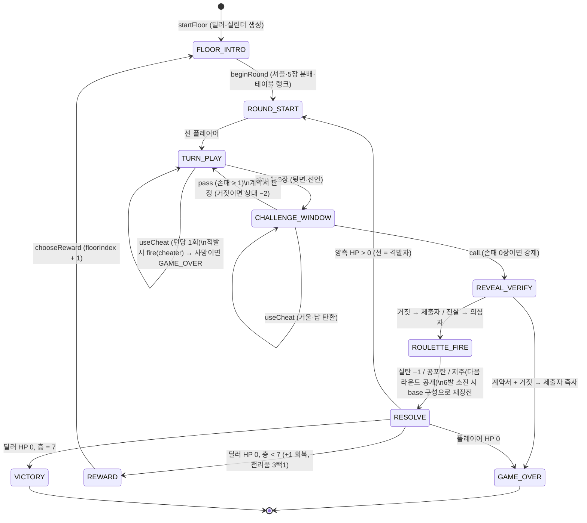

# [GDD] Dead Man's Hand: Devil's Parlor — 기획·설계서

- **문서 버전**: v1.1.0 (2026-09-10) · 원본 v1.0.0(2026-09-09)은 [`docs/archive/`](archive/2026-09-09_GDD_v1.0.0_original.md)에 그대로 보관
- **변경 요약**: [`docs/CHANGELOG.md`](CHANGELOG.md) · 되돌리기 어려운 결정: [`docs/DECISIONS.md`](DECISIONS.md) · 미뤄둔 개선점: [`docs/BACKLOG.md`](BACKLOG.md)
- **프로젝트 코드명**: Project Dead Man's Hand (망자의 패: 악마의 살롱)
- **라이브 데모(웹 프로토타입)**: <https://jeiel85.github.io/dead-mans-hand-devils-parlor/>
- **문서 목적**: 바이럴 인디 게임(《Liar's Bar》, 《Buckshot Roulette》) 분석에서 출발한 +α 차별화 설계를, **수치·룰·엣지케이스·AI·밸런스·리스크까지 즉시 개발 착수 가능한 수준**으로 확정한다.

> **상태 표기 규칙**
> ✅ **검증됨** — 웹 프로토타입에 구현되어 플레이·시뮬레이션으로 확인한 항목
> 🔧 **확정(미구현)** — 설계는 확정했고 본 개발(Godot/Unity)에서 구현할 항목
> 💭 **검토 중** — 대안이 남아 있어 플레이테스트 결과로 결정할 항목

---

## 0. 한눈에 보기 (Executive Summary)

| 항목 | 내용 |
| :-- | :-- |
| 한 줄 컨셉 | 영혼을 저당 잡힌 도박사가 악마의 살롱 **지하 7층**을 내려가며, **블러핑 카드 게임 + 러시안 룰렛**으로 딜러 보스를 꺾는 **싱글 로그라이크** |
| 장르 | 테이블탑 심리전 · 블러핑 · 서든데스 룰렛 · 로그라이크(런 기반 메타 프로그레션) |
| 레퍼런스 | 《Liar's Bar》(블러핑 룰), 《Buckshot Roulette》(공개 탄 구성·긴장 연출), 《Inscryption》(층계 보스·기믹), 《Balatro》(런 빌드 다양성) |
| 핵심 차별화 | ① 솔로 로그라이크 층계 돌파 ② 전술적 사기 도구 & 적발 리스크 ③ 비동기 고스트 대전 ④ 스트리밍 시청자 개입 |
| 1회 세션 | 층당 3~8분, 풀 런 20~40분(시뮬레이션 기준 평균 26~40라운드) |
| 플랫폼 | 1차 PC(Steam, Windows) → 2차 모바일/웹 · **현재**: 브라우저 프로토타입(데스크톱·모바일 반응형) |
| 타깃 | 스트리머·숏폼 시청자 유입층, 《Liar's Bar》·《Buckshot Roulette》를 5~10시간 안에 소진한 플레이어 |
| 가격 모델 | 유료 단품(스팀 $4.99~$7.99 권장), 인앱 결제·가챠 없음 (도박 묘사 + 실구매 결합 리스크 회피) |
| 성공 지표(초기) | 첫 런 완주율 ≥ 60%, 재도전율(1런 이상 추가) ≥ 50%, 중앙값 세션 ≥ 20분, 클립 공유 이벤트당 1회 이상의 "격발 순간" |
| 현재 상태 | 코어 루프·7층·7딜러·사기 도구 4종·유물 8종이 브라우저에서 플레이 가능. 고스트·스트리밍은 스펙 확정(미구현) |

---

## 1. 바이럴 인디 게임 벤치마킹 및 심층 분석

### 1.1 분석 대상과 장르 특성

| 레퍼런스 | 배우는 것 | 이 프로젝트에서 취하는 것 |
| :-- | :-- | :-- |
| 《Liar's Bar》 | 20장 덱(K/Q/A 6장 + 조커 2)과 "테이블 랭크 선언 → 의심/수용" 루프의 단순함 | 카드 룰 골격을 그대로 채택(§4). 1v1 딜러전으로 축소하되 다인 테이블은 백로그 |
| 《Buckshot Roulette》 | 탄 구성 공개(정보 게임화), 아이템으로 확률을 만지는 재미, 다이제틱 연출 | 6연발 실린더 공개 + 순차 챔버(§4.5), 사기 도구(§5), 1인칭·소품 중심 연출 방향(§12) |
| 《Inscryption》 | 층/보스 기믹으로 같은 룰에 새 문제를 부여 | 7층 7딜러 기믹(§6), 층 사이 보상 선택 |
| 《Balatro》 | 런마다 다른 빌드가 생기는 메타 프로그레션 | 유물 8종(§6.4)과 사기 도구 충전 보상. 목표는 "이번 런의 성격이 달라지는" 최소 세트 |

### 1.2 바이럴 핵심 성공 요인 (Viral Drivers)

1. **압축된 마이크로 클라이맥스**: 턴당 15~30초 안에 [선언] → [의심/수용] → [공개·격발]이 완결되어 숏폼 클립 단위로 잘린다. → 본 설계에서는 **"매 라운드 정확히 한 발"** 규칙(§4.6)으로 리듬을 보장한다.
2. **극단적 리액션 유발**: 공포탄의 "찰칵"과 실탄의 폭발음, 방아쇠를 당기는 순간의 감정 롤러코스터. → 격발 전 0.45초 해머 딜레이, 결과별 화면 플래시·사운드(§12.3)로 연출한다.
3. **3초 룰 이해(Low Friction)**: "맞는지 의심한다 / 실탄이냐 공포탄이냐"만 알면 관전 가능. → 튜토리얼 없이 **B1 딜러(체력 1, 낮은 집중도)** 가 튜토리얼 역할을 한다(§6.2).
4. **다이제틱 미니멀 인터랙션**: HUD 대신 테이블 위 소품을 집어 쓰는 촉각감. → 웹 프로토타입은 DOM 기반이지만 본 개발에서는 소품(거울·납덩이·계약서)을 3D 오브젝트로 배치한다(§12.1).

### 1.3 기존 게임의 한계점 (Pain Points) → 대응

| 한계 | 관찰 | 대응(§) |
| :-- | :-- | :-- |
| 5~10시간 내 콘텐츠 소진 | 최적 수가 드러나면 확률 계산·운 싸움으로 퇴화 | 층별 기믹·유물·사기 도구가 최적 수를 매 런 바꾼다(§5, §6) |
| 싱글 깊이 부재 | 《Buckshot Roulette》 AI 반복성, 《Liar's Bar》 싱글 부재 | 페르소나 파라미터 + 학습 메모리를 가진 딜러 AI(§7) |
| 공개 멀티 트롤링·탈주 | 조기 탈락자 이탈, 무조건 콜 트롤 | 1v1 싱글 코어 + 비동기 고스트 대전(§10). *주의: 고스트는 대기·탈주 문제를 없애지만 "실시간 상대"의 긴장감까지 대체하지는 못한다(§16 R-4)* |
| 메타 프로그레션 부재 | 세션 후 남는 것이 치장품뿐 | 런 내 유물/충전 빌드(§6.4) + 런 간 해금(💭 §6.5) |

---

## 2. 컨셉 & 차별화 (+α Innovations)

> **"영혼을 저당 잡힌 도박사들이 악마의 살롱 지하 층을 돌파하는 덱빌딩 블러핑 로그라이크"**

| # | 혁신 시스템 | 해결하는 문제 | 성공 판정 기준 | 상태 |
| :-- | :-- | :-- | :-- | :-- |
| +α1 | **싱글 로그라이크 층계 돌파** — B1(빈민가)부터 B7(악마의 VIP룸)까지 기믹 딜러 7명 | 싱글 깊이·콘텐츠 소진 | 첫 런 완주율 ≥ 60%, 숙련 시 승률 30~50% | ✅ |
| +α2 | **전술적 사기 도구 & 적발 리스크** — 밑장빼기·납 탄환·거울·계약서. 딜러 집중도에 따라 적발 시 즉시 격발 | 운 싸움으로의 퇴화 | 런당 사기 사용 ≥ 3회, 적발률 10~15% 구간 | ✅ |
| +α3 | **비동기 고스트 대전** — 실제 유저의 결정 로그를 직렬화해 "고스트 도박사"로 재생 | 매치메이킹 대기·탈주 | 고스트전 완료율 ≥ 90%, 고스트 vs AI 선호도 조사 | 🔧 |
| +α4 | **스트리밍 시청자 개입** — `!진실`/`!구라` 투표, 최다 후원자 대리 격발 | 스트리머 확산 | 연동 방송의 평균 시청 유지 시간 상승 | 🔧 |

---

## 3. 타깃·플랫폼·비즈니스

- **1차 타깃**: 20~34세, 트위치/유튜브/틱톡에서 《Liar's Bar》·《Buckshot Roulette》 클립을 소비한 층. 친구 없이도 혼자 즐길 "그 게임"을 찾는 사람.
- **2차 타깃**: 로그라이크 덱빌더 팬(《Balatro》, 《Slay the Spire》). 빌드·시드 공유 문화.
- **플랫폼 순서**: PC(Steam) → 모바일(세로 UI는 별도 검토) → 웹(데모·바이럴 채널). 웹 프로토타입은 **설계 검증 + 위시리스트 유입용 데모**로 유지한다.
- **가격/수익**: 단품 유료. 인앱 결제·가챠·실제 화폐 베팅은 도입하지 않는다(도박 묘사와 결합 시 등급·플랫폼 정책 리스크, §16).
- **운영 비용은 0이 아니다**: 고스트 서버·Twitch 연동·크래시 리포팅·플레이어 지원·백업은 인프라 비용이 낮아도 시간 비용이 남는다. 1인 개발 기준 주 2~4시간 운영 예산을 로드맵에 포함한다(§14).

---

## 4. 코어 룰 상세 ✅

### 4.1 구성물

| 항목 | 값 |
| :-- | :-- |
| 덱 | 20장 = 킹 6 · 퀸 6 · 에이스 6 · 조커 2 (유물 "검은 고양이" 보유 시 조커 3, 총 21장) |
| 손패 | 라운드마다 각 5장 (덱 20장 중 10장 분배, 나머지 10장은 덱 밑에 남는다 → 밑장빼기 대상) |
| 테이블 랭크 | 라운드마다 K/Q/A 중 무작위 1개 |
| 제출 장수 | 1~3장 |
| 리볼버 | 6연발 실린더 1정을 테이블에서 공유. 구성(실탄/공포탄/저주탄)은 공개, 순서는 비공개 |
| 체력 | 플레이어 3(유물로 최대 4), 딜러는 층별 1~4 |
| 도전 창 | 15초(끌 수 있음, §12.4). 시간 초과 시 패가 있으면 자동 "믿기", 없으면 자동 "의심" |

### 4.2 라운드 진행

1. **분배**: 덱 셔플 → 테이블 랭크 결정 → 각 5장. 선(先)은 층 첫 라운드는 플레이어, 이후는 **직전 라운드에 방아쇠를 당긴 쪽**.
2. **제출(play)**: 자기 차례에 1~3장을 뒤집어 내려놓고 "전부 테이블 랭크"라고 선언한다. 조커는 항상 진실로 취급. 제출 전(또는 응답 전) **사기 도구 1회** 사용 가능(§5).
3. **응답(respond)**: 상대는 **의심(Call)** 또는 **믿기(Pass)**.
   - 믿기 → 응답자가 곧바로 제출 차례가 된다.
   - **강제 콜**: 응답자의 손패가 0장이면 믿기가 불가능하고 의심만 가능하다. 이 규칙으로 라운드는 항상 유한하게 끝난다(총 10장, 제출마다 ≥1장 감소).
4. **공개(reveal)**: 의심이 나오면 마지막 제출 카드를 공개한다. 한 장이라도 테이블 랭크도 조커도 아니면 **거짓**.
   - 거짓 → 제출자가 방아쇠를 당긴다.
   - 진실 → 의심한 사람이 방아쇠를 당긴다.
5. **격발(fire)**: 현재 챔버가 발사되고 실린더가 한 칸 돈다(§4.5).
6. **라운드 종료**: **매 라운드 정확히 한 발**이 나가고 즉시 다음 라운드(재분배). 누군가 체력 0이면 층 종료.

### 4.3 탄환 종류

| 탄환 | 효과 |
| :-- | :-- |
| 실탄(Live) | 피격자 체력 −1 |
| 공포탄(Blank) | 없음. 긴장만 오른다 |
| 저주탄(Curse) | 체력 피해 없음. **다음 라운드 동안 피격자의 손패가 상대에게 공개**된다(공개된 쪽은 블러핑이 사실상 불가능). 원본 v1.0.0의 `OccultCurse`에 정의가 없어 v1.1.0에서 확정 |

### 4.4 엣지케이스 표

| 상황 | 처리 |
| :-- | :-- |
| 라운드 첫 제출 | 아직 응답할 대상이 없으므로 선이 무조건 제출 |
| 응답자 손패 0장 | 강제 콜(§4.2-3) |
| 제출자가 마지막 카드를 냈고 상대도 0장 | 상대가 강제 콜 → 공개·격발로 종료 |
| 실린더 6발 소진 | 층의 **기준 구성**으로 즉시 재장전(§4.5). 원본 코드의 `% chambers.Count` 순환(발사된 챔버 재발사) 버그를 정정 |
| 사기 적발로 격발 중 사망 | 라운드 즉시 종료, 층 실패 |
| 계약서(Pact) 발동 후 진실을 말함 | 계약서는 효력 없이 소모("재로 변한다") |
| 저주 상태에서 또 저주탄 피격 | 공개 상태가 다음 라운드까지 1라운드 연장되는 것이 아니라, 다음 라운드 1회 공개로 동일(중첩 없음) |
| 밑장빼기 대상이 이미 테이블 랭크/조커 | 사용 불가(UI에서 안내) |
| 덱에 테이블 랭크·조커가 남아 있지 않음 | 밑장빼기 실패(충전은 소모, 적발 판정은 수행) |

### 4.5 실린더 규칙

- 구성 예: B1 `실탄 2 · 공포탄 4 · 저주탄 0`. 셔플 후 챔버 0부터 순서대로 발사. **발사된 챔버의 종류는 즉시 공개**되어 남은 확률이 갱신된다(정보 게임).
- `다음 챔버 실탄 확률 = 남은 실탄 / 남은 챔버`를 UI에 항상 표시한다. 계산을 플레이어에게 떠넘기지 않는다.
- **납 탄환 바꿔치기**는 현재 장전분만 바꾼다. 6발 소진 후 재장전은 항상 층 기준 구성(`base`)으로 돌아간다. 딜러 기믹(악마)만 기준 구성을 바꿀 수 있다.

### 4.6 "매 라운드 한 발" 원칙

라운드마다 반드시 한 번의 격발이 있어 (a) 클립 단위 리듬이 유지되고 (b) 실린더 정보가 매 라운드 갱신되며 (c) 라운드 수가 곧 위험 노출량이 된다. 라운드가 길어지는 것(믿기 연쇄)은 손패 소진 → 강제 콜로 자연 수렴한다.

---

## 5. 사기 도구 & 리스크 시스템 ✅

### 5.1 도구 4종

| 도구 | 효과 | 사용 가능 시점 | 기본 적발률 | 시작 충전 |
| :-- | :-- | :-- | :-- | :-- |
| 탁자 밑 거울 (Mirror) | 다음 챔버 종류를 확인. 정보는 다음 격발 전까지 유효 | 제출 전 · 응답 전 | 10% | 1 |
| 밑장빼기 (Bottom Deal) | 손패 1장을 덱에 남은 테이블 랭크 카드(없으면 조커)와 교체 | 제출 전 | 15% | 1 |
| 납 탄환 바꿔치기 (Lead Weight) | 다음 챔버를 공포탄으로 교체(이미 공포탄이면 효과 없음, 정보는 얻음) | 제출 전 · 응답 전 | 25% | 1 |
| 악마의 계약서 (Pact of Greed) | 이번 제출이 **거짓이고 상대가 믿으면 상대 −2**. **의심당해 들키면 즉사**. 진실이면 무효 | 제출 전 | 0% (적발 대신 즉사 리스크) | 0 (보상으로만 획득) |

> v1.0.0 대비 변경: 거울·납 탄환은 "제출 전 1회"에서 **응답 전에도 사용 가능**으로 확장했다. 거울은 "지금 의심해도 되는가"를 결정할 때 가장 필요하기 때문이다. 턴당 1회 제한은 유지한다.

### 5.2 적발 판정 공식

```
적발 확률 p = 기본 적발률 × 딜러 집중도(focus) × 유물 보정
  · 가죽 장갑: ×0.6
  · 속임수 주사위: 거울은 p = 0
  · 상한 95%
적발 시: 효과 취소(거울은 정보 미제공) + 즉시 격발 1회 (판사 그림: 2회)
       → 사망하면 층 실패, 아니면 같은 턴이 계속된다(도구는 이미 소모)
```

집중도는 딜러 페르소나 값(0.5~1.6)이며 UI에 항상 표시한다. **플레이어는 "이 딜러 앞에서 사기가 얼마나 위험한지"를 항상 알 수 있어야 한다.**

### 5.3 설계 의도

- 도구는 **확률을 정보로, 정보를 결정으로** 바꾸는 장치다. 순수 운 요소(어느 챔버가 실탄인가)를 "알 수 있는가, 대가를 치를 것인가"의 선택으로 바꾼다.
- 계약서는 의도적으로 고분산 아이템이다. 딜러가 잘 의심하지 않는 층(B1, B2)에서 강하고, 의심 편향이 높은 층(B6, B7)에서 자살 행위다. 이 낙차가 층별 "정답 빌드"를 다르게 만든다.

---

## 6. 로그라이크 구조: 7층 · 딜러 보스 · 보상 · 유물 ✅

### 6.1 층 구성 (`src/data.js` FLOORS가 단일 진실 원천)

| 층 | 장소 | 딜러 | 딜러 HP | 실린더(실/공/저) | 의도 |
| :-- | :-- | :-- | :-- | :-- | :-- |
| B1 | 빈민가 골목 | 취객 잭 | 1 | 2/4/0 | 튜토리얼. 한 발이면 끝. 룰을 몸으로 익힌다 |
| B2 | 밀주 창고 | 밀주업자 마사 | 2 | 2/4/0 | "거짓말쟁이를 읽는 법" — 블러핑 60% |
| B3 | 뒷방 도박장 | 카드 세는 도미닉 | 3 | 3/2/1 | 카운팅 + 학습 AI, 저주탄 첫 등장 |
| B4 | 전당포 | 전당포 주인 이다 | 3 | 3/3/0 | 사기 억제(집중도 1.6). 도구 없이 읽기만으로 이겨야 한다 |
| B5 | 혈액 은행 | 간호사 벨라 | 3(+1 회복 1회) | 3/2/1 | 지구전. 체력 관리 시험 |
| B6 | 지하 법정 | 판사 그림 | 4 | 4/2/0 | 사기 적발 2발. 실탄 4발의 고압 |
| B7 | 악마의 VIP룸 | 살롱 주인(악마) | 4 | 4/1/1 → 피해마다 실탄 +1(최대 5) | 최종. 시간을 끌수록 불리 |

### 6.2 딜러 페르소나 & 기믹 (`src/data.js` DEALERS)

| 딜러 | focus | bluffRate | callBias | noise | greed | 기믹 |
| :-- | :-- | :-- | :-- | :-- | :-- | :-- |
| 취객 잭 | 0.5 | 0.50 | −0.15 | 0.30 | 2 | **drunk**: 판단 노이즈 ±0.3, 의심을 잘 안 함 |
| 밀주업자 마사 | 0.8 | 0.60 | −0.05 | 0.10 | 3 | **aggressive**: 블러핑 시 최대 3장 |
| 카드 세는 도미닉 | 1.0 | 0.30 | +0.05 | 0.05 | 2 | **counter**: 플레이어 거짓 비율 학습 가중 0.5(타 딜러 0.2) |
| 전당포 주인 이다 | 1.6 | 0.30 | +0.05 | 0.05 | 2 | **hawkeye**: 사기 적발 ×1.6 |
| 간호사 벨라 | 1.0 | 0.40 | 0.00 | 0.10 | 2 | **mender**: 체력 1 도달 시 1회 +1 |
| 판사 그림 | 1.3 | 0.25 | +0.10 | 0.05 | 2 | **verdict**: 사기 적발 시 격발 2회 |
| 살롱 주인 | 1.5 | 0.45 | +0.10 | 0.05 | 3 | **proprietor**: 피해마다 기준 구성 실탄 +1로 즉시 재장전 |

각 딜러는 **입장 대사 1줄 + 기믹 설명 1줄**을 층 인트로에서 보여준다. 플레이어는 첫 대면에서 무엇이 다른지 알아야 한다(숨은 기믹은 두지 않는다).

### 6.3 층 클리어 보상

- 층 클리어 시 **체력 +1 자동 회복**(최대치 이내) + **전리품 1개 선택**.
- 선택지 3개 = **붕대(+1 체력)** 고정 1개 + (사기 도구 충전 4종 ∪ 미보유 유물) 중 무작위 2개.
- 붕대를 항상 두는 이유: "회복 vs 성장"이 매 층의 실제 선택이 되게 하기 위해서다. 시뮬레이션에서 체력이 깎인 봇은 붕대를, 만피 봇은 유물을 고를 때 생존율이 가장 높았다(§8.4).

### 6.4 유물 8종 (`src/data.js` RELIC_IDS)

| 유물 | 효과 | 빌드 방향 |
| :-- | :-- | :-- |
| 담배 케이스 | 최대 체력 +1, 즉시 +1 | 지구전 |
| 낡은 술병 | 런당 1회 치명상을 체력 1로 버팀 | 보험 |
| 가죽 장갑 | 모든 사기 적발률 ×0.6 | 사기꾼 빌드 |
| 표식 카드 | 라운드 시작 시 딜러 카드 1장 엿보기 | 정보 |
| 회중 성경 | 나를 향한 실탄 25% 불발 | 운 보정 |
| 뱀 기름 | 층 클리어 시 +1 추가 회복 | 지구전 |
| 속임수 주사위 | 거울 적발 0% | 정보 |
| 검은 고양이 | 덱 조커 +1 | 정직 빌드(진실 카드 증가) |

### 6.5 런 간 메타 프로그레션 💭

- 후보 A: 딜러 격파 수에 따라 시작 유물 선택지 해금(파워 인플레 없음, 선택 폭만 증가).
- 후보 B: "악마의 장부" — 누적 통계·업적·시드 기록만 제공.
- **결정 기준**: 첫 플레이테스트에서 재도전율이 50% 미만이면 A, 이상이면 B로 시작한다. 파워 상승형 메타(영구 체력 +1 등)는 밸런스를 망가뜨리므로 채택하지 않는다.

---

## 7. 딜러 AI 설계 ✅ (`src/ai.js`)

### 7.1 원칙

- **읽을 수 있어야 한다**: 완벽한 베이지안 상대가 아니라, 페르소나 편향과 노이즈가 있는 상대. 플레이어가 "이 녀석은 3장 낼 때 늘 거짓"처럼 패턴을 발견할 여지를 남긴다.
- **속이지 않는다**: 딜러는 플레이어의 비공개 손패를 보지 않는다(저주 공개 상태 제외). 자기 손패·공개된 실린더 정보·누적 선언 장수만 쓴다.

### 7.2 제출 판단 `dealerDecidePlay`

1. 손패를 진실 카드(테이블 랭크+조커)와 거짓 카드로 나눈다.
2. 플레이어 손패가 0장이면 다음 응답은 강제 콜이므로 **진실 카드가 있으면 전부 진실로 낸다**.
3. 그 외: 거짓 카드가 있고 (진실 카드가 없거나 `bluffRate` 확률에 걸리면) 블러핑. 블러핑 장수는 1(aggressive는 최대 greed).
4. 정직 제출은 1~2장, 조커는 뒤로 미룬다(나중 라운드 대비).

### 7.3 응답 판단 `dealerDecideRespond`

```
pLie  = 플레이어 마지막 제출이 거짓일 추정 확률
        · 저주로 공개된 상태면 실제 값(0/1)
        · 내 손패의 진실 카드 수 + 플레이어 누적 선언 장수 > 덱의 진실 카드 총수(8, 검은 고양이 9)면 1 (불가능 선언)
        · 기본값 n장 기준 {1: .30, 2: .45, 3: .65} + 0.12 × (누적 선언 − 기대 보유량)
        · 학습: (플레이어 거짓 비율 − 0.4) × (counter 0.5 / 그 외 0.2), 2회 이상 공개 후부터
pLive = 남은 실탄 / 남은 챔버
score = pLie + callBias − 0.25 × (pLive − 0.5) ± noise
        · 플레이어 손패 0장: 내 진실 카드가 있으면 −0.35(믿고 넘겨 강제 콜 유도), 없으면 +0.35
call if score ≥ 0.5   (손패 0장이면 무조건 call)
```

### 7.4 텔(Tell) 💭

본 개발에서는 판단 점수를 **연출 신호**로 번역한다: score 0.4~0.6 구간이면 "고민" 애니메이션을 길게, noise가 큰 딜러(잭)는 무작위 딜레이. 웹 프로토타입은 0.7~1.4초 무작위 대기만 구현했다.

---

## 8. 밸런스 & 시뮬레이션 ✅

### 8.1 목표치

| 지표 | 목표 | 근거 |
| :-- | :-- | :-- |
| B1 통과율 | ≥ 85% (초심자) | 첫 5분에 죽으면 다시 오지 않는다 |
| 풀 런 승률 | 초심자 3~8%, 숙련 30~50% | 로그라이크 관례(초기 《Slay the Spire》 승률대) |
| 층별 통과율 | B2 이후 55~95%, 단조 감소는 강제하지 않음 | 층마다 다른 "시험"이 있어야 함 |
| 사기 적발률 | 런 평균 10~15% | 너무 낮으면 리스크가 무의미, 높으면 도구를 안 씀 |

### 8.2 시뮬레이션 방법

`node tools/simulate.js 3000 both` — 시드 고정 3,000런. 봇 2종:

- **naive**: 진실 카드가 있으면 75% 정직, 의심은 선언 장수·실탄 확률 기반의 단순 규칙. "규칙만 아는 초심자".
- **sharp**: 딜러의 bluffRate를 알고, 자기 손패로 거짓 확률을 추정하며, 거울·납 탄환을 확률 구간에서만 쓰는 "숙련자 상한선".

실제 사람은 두 봇 사이 어딘가에 있다. 재현: `npm run sim -- 3000 both`.

### 8.3 결과 (v1.1.0 수치, 3,000런)

| 층 | naive 통과율 | sharp 통과율 |
| :-- | --: | --: |
| B1 취객 잭 | 85.8% | 95.8% |
| B2 밀주업자 마사 | 80.5% | 96.2% |
| B3 카드 세는 도미닉 | 61.5% | 87.5% |
| B4 전당포 주인 이다 | 56.0% | 90.8% |
| B5 간호사 벨라 | 48.9% | 84.8% |
| B6 판사 그림 | 47.9% | 91.5% |
| B7 살롱 주인 | 56.3% | 89.2% |
| **풀 런 승률** | **3.1%** | **50.7%** |
| 평균 라운드 | 26.1 | 39.9 |
| 사기 적발률 | 10.5% | 13.4% |

### 8.4 튜닝 과정에서 배운 것

- 초기안(플레이어 3 HP, 층 회복 없음, 딜러 HP 합 21)은 sharp 봇 승률 0.4%. **격발이 대칭적인 게임에서 플레이어가 7명을 연달아 이기려면 회복·정보 우위가 구조적으로 필요**하다. → 층 클리어 +1 회복, 붕대 고정 선택지, 시작 도구 3충전.
- B1 딜러 HP 2는 naive 통과율 66~71%로 너무 가혹했다. HP 1로 낮추자 86%. 튜토리얼 보스는 "룰을 배우는 비용"만 받아야 한다.
- 납 탄환이 재장전 구성을 영구히 바꾸던 버그(실탄 0발 → 무한 라운드)를 시뮬레이션이 잡아냈다. 회귀 테스트 추가.
- sharp 봇 50.7%는 상한선으로는 적절하지만, 사람 숙련자가 40%를 넘기면 B4~B7 딜러 HP 또는 실탄 수를 한 단계 올린다. **튜닝 레버 우선순위**: ① 층 회복량 ② 시작 도구 충전 ③ 딜러 HP ④ 실린더 구성 ⑤ 적발률.

---

## 9. 게임 상태 머신 (FSM) ✅

원본 v1.0.0의 FSM을 유지하되 세 가지를 정정·추가했다: (1) 라운드는 격발 후 항상 재분배, (2) 사기 적발 분기(즉시 격발 후 같은 턴 유지), (3) 강제 콜.



구현 대응: `src/rules.js`의 `PHASE`(title/floorIntro/round/reward/gameOver/victory) × `round.phase`(play/respond/over) × `round.turn`(player/dealer). 모든 전이는 `state.events`에 이벤트를 남기며, UI는 이벤트만 보고 연출한다(엔진은 DOM·타이머를 모른다).

---

## 10. 비동기 고스트 대전 스펙 🔧

### 10.1 무엇을 기록하는가

원본 v1.0.0의 `GhostTurnRecord`(망설임 시간·커서 궤적 포함)를 다음과 같이 조정한다.

| 필드 | 기록 | 비고 |
| :-- | :-- | :-- |
| 결정 로그 | play(카드 id 목록·선언 장수) / respond(call·pass) / cheat(종류·대상) | **재생에 필수**. 엔진 이벤트 로그 그대로 |
| 시드 | 런 시드 + 층 인덱스 + 라운드 번호 | 결정론 RNG(§13.3) 덕분에 로그 + 시드만으로 완전 재현 |
| 망설임 시간 | 결정까지 걸린 ms (0.1초 단위로 양자화) | 텔 연출용. 상한 15초 |
| 커서 궤적 | **기록하지 않는다** | 개인정보·용량 대비 효용이 낮고, 마우스/터치/패드마다 의미가 다르다. 대신 "고민 애니메이션 길이"만 재생 |
| 닉네임 | 선택 사항, 서버 측 필터 | 기본값 익명 도박사 #NNNN |

### 10.2 재생 방식

- 고스트는 **딜러 슬롯**에 들어간다(1v1 구조 유지). 고스트의 결정 로그를 상황 키(`손패 진실 수 × 상대 선언 장수 × 실탄 확률 구간`)로 색인하고, 같은 키가 없으면 그 유저의 통계(블러핑 비율·콜 비율)로 페르소나 파라미터를 합성해 §7 AI로 대체한다.
- 즉, 고스트 = **"그 사람의 성향으로 조정된 AI + 실제로 했던 결정 우선 재생"**. 완전 재현이 아니라는 점을 UI에 명시한다.

### 10.3 저장·전송·프라이버시

- 포맷: JSON Lines, 라운드당 1줄, 런당 ≤ 20KB 목표.
- 업로드는 **옵트인**(첫 실행 시 명시 동의), 언제든 삭제 요청 가능, 닉네임 외 식별 정보 없음.
- 서버 없이 시작: 로컬 고스트(내 과거 런과 대전) → 이후 정적 호스팅에 커뮤니티 고스트 팩 배포 → 마지막에 업로드 API. MVP는 1단계만.

### 10.4 안티치트

고스트는 경쟁 랭킹이 아니므로 검증은 최소화한다: 시드 재생으로 로그 일관성만 확인(불가능한 결정은 폐기).

---

## 11. 스트리밍 연동 스펙 🔧

| 항목 | 설계 |
| :-- | :-- |
| 채널 | Twitch EventSub(WebSocket) 1차, YouTube Live Chat 폴링 2차 |
| 투표 | 플레이어 응답 창 15초 동안 `!진실`/`!구라`(en: `!truth`/`!lie`). 결과는 **참고 정보**로만 표시(자동 결정 없음). 채팅 1인 1표 |
| 대리 격발 | 격발 순간 "최다 후원자/랜덤 시청자 닉네임"이 공이치기에 각인되고 그 이름으로 격발 연출. **결과에 영향 없음**(순수 연출) |
| 시청자 저주 | 💭 채널 포인트로 다음 라운드 테이블 랭크 지정 — 밸런스 영향이 있어 옵션 게이트 |
| 악용 방지 | 닉네임 금칙어 필터, 길이 제한, 방송인 측 기능별 on/off, 투표 스팸 rate limit |
| 오프라인 폴백 | 연동 실패 시 조용히 비활성(게임 진행에 절대 영향 없음) |
| 개인정보 | 채팅 닉네임만 일시 사용, 저장하지 않음 |

---

## 12. UX · 연출 · 아트 · 사운드 방향

### 12.1 다이제틱 UI 원칙 🔧
- 체력은 촛불/영혼 조각, 사기 도구는 테이블 위 실물(거울·납덩이·계약서·카드 더미). 웹 프로토타입은 버튼으로 대체했지만 **정보 위계**(테이블 랭크 > 실린더 확률 > 손패 > 도구)는 동일하게 유지한다.
- 실린더는 항상 화면에 보이고, 발사된 챔버의 종류가 남는다(플레이어가 세지 않아도 된다).

### 12.2 15초 도전 창 ✅
- 응답 시 원형 타이머. 5초 이하 붉게·틱 소리. 시간 초과 시 §4.1 규칙으로 자동 처리하고 로그에 남긴다.

### 12.3 격발 연출 ✅(프로토타입 수준)
- 해머 코킹(0.45초) → 결과음(실탄: 노이즈 버스트 + 저역 임팩트 / 공포탄: 짧은 클릭 / 저주: 불협 톤) → 화면 플래시(적/백/보라) → 결과 텍스트. 본 개발에서는 카메라 흔들림·슬로모션·바이네팅 추가.
- 모든 사운드는 Web Audio 절차 생성(외부 에셋 0). 본 개발에서는 실녹음으로 교체하되 타이밍 값은 유지한다.

### 12.4 접근성 ✅
- 타이머 끄기(설정), 감광성 배려(`prefers-reduced-motion` 시 애니메이션·플래시 제거), 색약 배려(실탄/공포탄/저주탄을 색 + 기호 ●○✦로 이중 표기), 키보드 조작(카드 Enter/Space, C=의심, P=믿기), 모바일 반응형.
- 💭 자해 묘사 완화 옵션("방아쇠" 대신 "카드 뽑기" 연출) — 등급·플랫폼 대응용으로 검토(§16 R-1).

### 12.5 로컬라이징 ✅
- 한국어 원문, 영어 병행. 문자열 키 기반(`src/i18n.js`). 조사(이/가·을/를) 자동 처리는 미구현 → 백로그.

---

## 13. 기술 아키텍처

### 13.1 본 개발 엔진 선정 🔧 (원본 유지)
- **Godot 4.3+(C#)** 권장, Unity 대안. 2.5D 하이브리드(로우폴리 환경 + 2D 캐릭터). 1인 개발 이터레이션 속도·빌드 경량화·웹/모바일 포팅 용이성이 근거. 상세 비교는 [`DECISIONS.md` D-001](DECISIONS.md).

### 13.2 웹 프로토타입 아키텍처 ✅

```
index.html / styles.css        표현 (외부 에셋·빌드 도구 0)
src/data.js                    수치 단일 원천 (층·딜러·도구·유물)
src/rng.js                     시드 RNG (xmur3 → mulberry32)
src/rules.js                   순수 엔진: 상태 + 액션 + 이벤트 (DOM/타이머 없음)
src/ai.js                      딜러 판단 (순수 함수)
src/render.js                  상태 → HTML 조각
src/main.js                    컨트롤러: 입력·연출 큐·타이머·저장
src/audio.js / src/i18n.js     절차 사운드 / 문자열
tests/*.test.js                node:test — 룰·AI·퍼즈(300런 종료성·카드 보존·HP 범위)
tools/simulate.js              밸런스 시뮬레이터(naive/sharp 봇)
```

**엔진을 순수 함수로 분리한 이유**: 같은 `rules.js`가 (a) 브라우저 UI, (b) 테스트, (c) 시뮬레이터, (d) 미래의 고스트 재생기에서 그대로 돌아간다. 본 개발 C# 포팅 시에도 이 경계를 유지한다.

### 13.3 결정론과 시드 ✅
- 모든 무작위는 `state.rng`를 통해서만 발생. 같은 시드 → 같은 분배·실린더·딜러 판단. 시드는 UI에 항상 표시되고 입력 가능(버그 재현·데일리 시드·고스트 재생의 기반).

### 13.4 데이터 스키마 (C#, 본 개발용) 🔧 — 원본 정정판

```csharp
public enum BulletType { Blank, Live, Curse }

public sealed class RevolverCylinder {
    private readonly List<BulletType> _chambers = new();
    private readonly IRng _rng;
    public CylinderSpec Base { get; private set; }     // 재장전 기준(층 스펙 또는 기믹으로 상향)
    public int Index { get; private set; }
    public IReadOnlyList<BulletType> Spent => _spent;
    private readonly List<BulletType> _spent = new();

    public RevolverCylinder(IRng rng, CylinderSpec spec) { _rng = rng; Load(spec); }

    public void Load(CylinderSpec spec) {
        Base = spec; _chambers.Clear(); _spent.Clear(); Index = 0;
        _chambers.AddRange(Enumerable.Repeat(BulletType.Live, spec.Live));
        _chambers.AddRange(Enumerable.Repeat(BulletType.Blank, spec.Blank));
        _chambers.AddRange(Enumerable.Repeat(BulletType.Curse, spec.Curse));
        _rng.Shuffle(_chambers);                        // Fisher-Yates, 시드 RNG
    }

    public BulletType PeekNext() => _chambers[Index];  // 거울
    public bool SwapNextToBlank() {                     // 납 탄환: 현재 장전분만 바꾼다
        if (_chambers[Index] == BulletType.Blank) return false;
        _chambers[Index] = BulletType.Blank; return true;
    }

    public BulletType PullTrigger() {
        var fired = _chambers[Index];
        _spent.Add(fired); Index++;
        if (Index >= _chambers.Count) Load(Base);       // 원본의 % 순환(재발사 버그) 대신 기준 구성으로 재장전
        return fired;
    }
}

[Serializable] public sealed class GhostDecision {      // 커서 궤적 제거, 결정 로그 중심
    public int Floor, Round, Turn;
    public string Kind;              // "play" | "respond" | "cheat"
    public int[] CardIds; public int Claim;
    public string Response;          // "call" | "pass"
    public string Cheat;             // "mirror" | ...
    public int HesitationMs;         // 0.1초 양자화, 상한 15000
}
[Serializable] public sealed class GhostProfile {
    public string GhostId, DisplayName, Seed; public int Version;
    public List<GhostDecision> Decisions;
    public float BluffRate, CallRate;  // 폴백 페르소나 합성용 통계
}
```

### 13.5 세이브·텔레메트리 🔧
- 세이브: 런 상태 = 시드 + 액션 로그(재생으로 복원). 층 시작 시점만 저장(라운드 중 저장은 세이브 스커밍 방지 차원에서 불허).
- 텔레메트리(옵트인): 층별 사망, 라운드 수, 도구 사용/적발, 보상 선택. §8 목표치 검증에 그대로 쓴다. 개인 식별 정보 없음.

---

## 14. 개발 로드맵

### 14.1 현재까지 (2026-09-10)
- ✅ 웹 프로토타입: 코어 루프·7층·7딜러·도구 4·유물 8·시드·KR/EN·접근성 옵션·테스트 21건·시뮬레이터. GitHub Pages 라이브.

### 14.2 본 개발 8주(원본 유지, 게이트 추가)

| 주차 | 산출물 | 통과 게이트 |
| :-- | :-- | :-- |
| 1~2 | Godot/Unity 코어 피지컬 프로토타입(실린더 격발 손맛·카드 조작·1인칭) | 5명 외부 테스트에서 "격발 순간이 긴장된다" 4/5 이상 |
| 3~4 | `rules.js` 1:1 포팅(C#) + 딜러 AI + 사기 시스템, 웹 프로토타입 시드로 교차 검증 | 동일 시드 100런 결과 일치 |
| 5~6 | 고스트 레코더(로컬) + 재생기, B1~B3 아트 패스, 유물 15종으로 확장 | 고스트전 완료율 ≥ 90% |
| 7~8 | Twitch 연동 오버레이, 포스트 프로세싱, 스팀 데모 빌드 | 넥스트 페스트 제출 체크리스트 통과 |

운영 예산(주 2~4시간: 크래시 리포트·플레이어 문의·고스트 데이터 정리)을 별도로 잡는다.

---

## 15. KPI & 검증 계획

| 단계 | 방법 | 지표 | 판정 |
| :-- | :-- | :-- | :-- |
| P0 (지금) | 웹 데모 공개 + 시뮬레이터 | §8.1 목표치 충족 여부 | 충족 |
| P1 | 외부 10명 무언 플레이테스트(화면 녹화) | 룰 설명 없이 B1 통과 ≥ 8명, "의심/믿기" 오해 0 | 미실시 |
| P2 | 데모 100세션 텔레메트리 | 첫 런 완주율 ≥ 60%, 재도전율 ≥ 50%, 중앙값 20분+ | 미실시 |
| P3 | 스트리머 3명 연동 방송 | 격발 순간 채팅 속도 스파이크, 클립 생성 수 | 미실시 |

**측정 없이 기능을 더 쌓지 않는다.** P1 결과가 나오기 전에는 다인 테이블·메타 해금 같은 확장을 시작하지 않는다.

---

## 16. 리스크 레지스터

| ID | 리스크 | 영향 | 대응 |
| :-- | :-- | :-- | :-- |
| R-1 | **자해(러시안 룰렛) 묘사 → 등급·플랫폼 정책** (성인 등급 가능성, 일부 모바일 스토어·지역 제한) | 출시 채널 축소 | 사전 등급 심의 문의, "카드 뽑기" 대체 연출 옵션(§12.4), 스팀 우선 |
| R-2 | 도박 묘사 + 실구매 결합 규제 | 판매 중단 | 인앱 결제·가챠·실화폐 베팅 금지(§3) |
| R-3 | 레퍼런스 유사성 논란(《Liar's Bar》 룰 골격) | 평판 | 룰은 퍼블릭 도메인 "Liar's Dice/Cheat" 계열임을 명시, 아트·명칭·연출 독자 개발, 상표 미사용 |
| R-4 | 고스트 대전이 "진짜 멀티"를 대체하지 못한다는 기대 불일치 | 리뷰 하락 | 스토어 문구에 "비동기·AI 보정" 명시, 실시간 멀티는 약속하지 않음 |
| R-5 | 고스트 데이터 개인정보(닉네임·행동 로그) | 법적 | 옵트인·익명 기본·삭제 경로·커서 궤적 미수집(§10.3) |
| R-6 | Twitch/YouTube API 변경·정책 | 기능 중단 | 연동은 순수 연출로 격리, 실패 시 조용히 비활성(§11) |
| R-7 | 1인 개발 범위 초과 | 지연 | 게이트 기반 로드맵(§14), 백로그로 이월, 다인 테이블은 P2 이후 |
| R-8 | 밸런스 붕괴(계약서·회중 성경 등 고분산 요소) | 재미 저하 | 시뮬레이터 상시 실행(CI), 튜닝 레버 우선순위(§8.4) |

---

## 17. 오픈 이슈 / 결정 대기

1. 런 간 메타 프로그레션 A/B(§6.5) — P1 결과로 결정.
2. 다인 테이블(3~4인, 고스트 혼합) 도입 시점 — P2 이후.
3. 자해 묘사 완화 옵션의 기본값 — 등급 심의 문의 결과로 결정.
4. 모바일 세로 UI — 웹 반응형은 검증됐으나 네이티브 세로 모드는 별도 설계 필요.
5. 한국어 조사 자동 처리 — 문자열 시스템 개선(백로그).

---

## 부록 A. 용어집

| 용어 | 정의 |
| :-- | :-- |
| 테이블 랭크 | 이번 라운드에 "전부 이것"이라고 선언해야 하는 카드 랭크(K/Q/A) |
| 선언(Claim) | 뒷면으로 낸 카드 장수(내용은 항상 "전부 테이블 랭크") |
| 의심(Call) / 믿기(Pass) | 응답 선택. 의심은 공개·격발로, 믿기는 내 제출 차례로 이어진다 |
| 강제 콜 | 손패 0장인 응답자의 유일한 선택 |
| 집중도(Focus) | 딜러별 사기 적발 배수 |
| 기준 구성(Base) | 재장전 시 돌아가는 실린더 스펙 |
| 고스트 | 다른 플레이어의 결정 로그로 조정된 딜러 슬롯 상대 |

## 부록 B. 문서 이력

| 버전 | 일자 | 내용 |
| :-- | :-- | :-- |
| v1.0.0 | 2026-09-09 | 최초 작성(벤치마킹·+α·코어 루프·FSM·데이터 모델·8주 로드맵) |
| v1.1.0 | 2026-09-10 | 룰 정밀화·엣지케이스, 저주탄/계약서 정의, 7층·7딜러·유물·보상 확정, AI 모델, 밸런스 시뮬레이션, 고스트/스트리밍 스펙, UX/접근성, 아키텍처·스키마 정정, KPI·리스크 추가. 웹 프로토타입으로 ✅ 항목 검증 |
